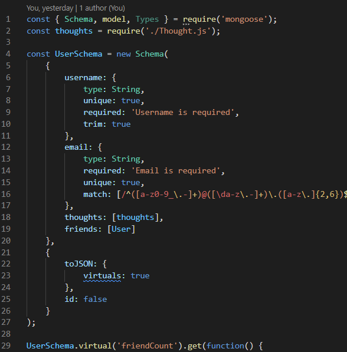

# zpl-social-network-1

## User Story
AS A social media startup
I WANT an API for my social network that uses a NoSQL database
SO THAT my website can handle large amounts of unstructured data

## Acceptance Criteria

GIVEN a social network API
WHEN I enter the command to invoke the application
THEN my server is started and the Mongoose models are synced to the MongoDB database
WHEN I open API GET routes in Insomnia for users and thoughts
THEN the data for each of these routes is displayed in a formatted JSON
WHEN I test API POST, PUT, and DELETE routes in Insomnia
THEN I am able to successfully create, update, and delete users and thoughts in my database
WHEN I test API POST and DELETE routes in Insomnia
THEN I am able to successfully create and delete reactions to thoughts and add and remove friends to a user’s friend list

 ## Description
  
  - What was my motivation? I wanted to create a social network API that uses a NoSQL database so that a website can handle large amounts of unstructured data.
  - Why did I build this project? I built this project to test my skills with using a NoSQL database like MongoDB and Mongoose, as well.
  - What problem does it solve? It solves the problem of needing to build an API for a social network web application where users can share their thoughts, react to friends’ thoughts, and create a friend list.
  - What did I learn? I learned how to use a NoSQL database like MongoDB and Mongoose to create a practical real-world application. 
  - What makes my project stand out? The models for my application are very readable.
  
  
  ## Table of Contents

  - [Description](#description)
  - [License](#license)
  - [Features](#features)

  ## Usage

  

  [Demonstration Video](https://youtu.be/QMQNCfd1Av4)
  

  ## License

  No license.

  ---

  ## Features
  
  If your project has a lot of features, list them here.

  ## Questions?
  If you have any questions, check out my [GitHub profile](https://github.com/zachary-levin) at or email me at [zlevin706@gmail.com](mailto:zlevin706@gmail.com)